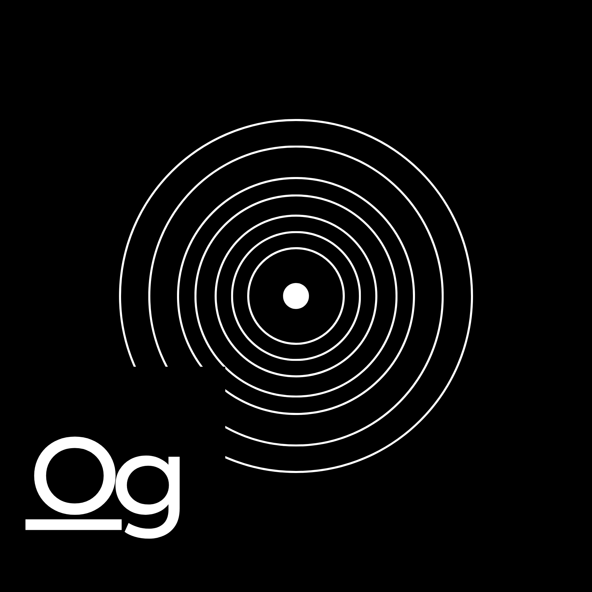

# Ogneson

> **Small Map for All Chemical Elements**
> 
> **Ogneson** is a "by students, for students" web application. It acts as a **student-focused chemistry reference** designed to provide structured, accurate, and visual information for all **118 chemical elements**. 

## 🚀 Overview

The application emphasizes visual perception, scientific clarity, standardized data representation, and symbol-based learning aligned with modern chemistry curricula. It is designed to be highly responsive and renders flawlessly across all devices and platforms without performance glitches.

It organizes elements using **consistent schemas**, making it exceptionally suitable for:
* Conceptual learning
* Analytical understanding of periodic trends
* Chemical behavior deep-dives

## 🛠️ Key Design Principles

* **Symbol-Centric + Visuals:** Interweaves visual notations with scientifically grounded descriptions. This framework enables faster recall and improves the psychological association between an element's symbol, identity, and raw properties.
* **Academic Accuracy:** Tailored for educational utility without sacrificing technical and conceptual depth.
* **Work-Ready Architecture:** Built with an extensible mindset, ensuring that data states are predictable, extensible, and perfectly compatible with web-based modern educational frameworks. 

## 📦 Project Structure Notes

The application uses modular React components designed for real-time interactivity:
* `header.tsx` — Houses the global navigation layout, branding, and dynamic reactive search features.
* `periodic.tsx` — Handles dynamic client-side filtering, category layout mapping, and rendering the reactive 18-column grid framework.

## 🔄 Maintenance & Support

The platform is actively maintained, thoroughly audited, and continuously checked by the development team to keep up with curriculum standards and dependencies.

